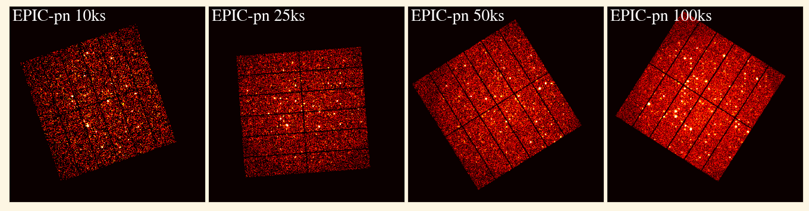

# Python tools for *XMM-Newton* SIXTE simulations

This repository contains Python modules for generating realistic simulations 
of *XMM-Newton* imaging observations using [SIXTE](https://www.sternwarte.uni-erlangen.de/sixte/) 
(SImulation of X-ray TElescopes; [Dauser et al. 2019](http://dx.doi.org/10.1051/0004-6361/201935978)). 

The standard distribution of SIXTE includes a basic instrumental model for the 
*XMM-Newton* cameras that consists of only a single CCD. We have therefore extended 
this model by defining new instrumental files for all CCDs in each camera. We provide
a Jupyter Notebook in [`epic_xmm_files`](epic_xml_files/epic_sixte_xml.ipynb) showing 
how to create these instrumental files. The vignneting behaviour and realistic 
particle backgrounds are also included. The final event files produced by SIXTE for 
each CCD are merged and modified so they can be processed further using *XMM-Newton* 
[Science Analysis System](https://www.cosmos.esa.int/web/xmm-newton/what-is-sas) tasks.

We also provided tools for including the astrophysical background, constant and transient 
sources, and full source catalogues in the simulations. Check the example scripts for 
learning how to use these tools.

The main motivation for developing these tools was the creation of a 
[large set of simulations](set_of_xmm_simulations_statix.py) used to characterize the 
performance of the [STATiX source detection pipeline](https://github.com/ruizca/statix) 
([Ruiz et al. 2024, A&A](https://doi.org/10.1093/mnras/stad3339)). Check the paper for 
a detailed explanation of the full setup of these simulations.

Dependencies
============
SIXTE and SAS has to be installed in your system and initilized for using these tools. 
The following Python packages are also needed:

* astropy
* astropy-healpix
* numpy
* sixty
* pxsas
* mocpy (>= v0.12)

 
